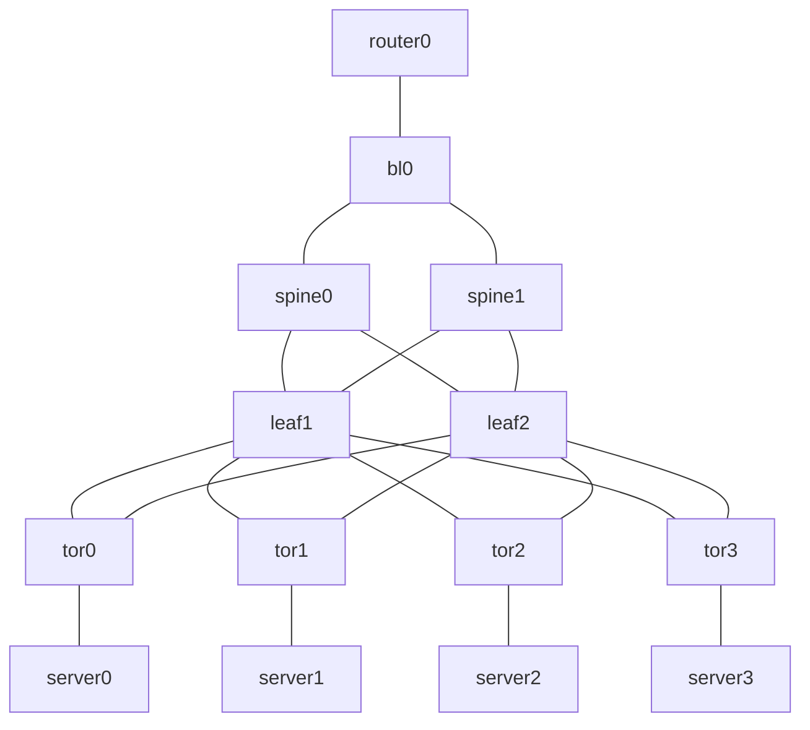

# closlab

A tool to generate Clos network topology for [containerlab](https://containerlab.dev/).

Build an L3 fabric with BGP Unnumbered using BIRD 3.

## Features

- RFC 7938 compliant BGP design
- BGP Unnumbered (IPv6 link-local address, deterministic via MAC EUI-64)
- BFD for fast failure detection
- Graceful Restart
- Per-layer prefix filters
- Anycast address (10.100.0.1/32)
- Customizable BIRD templates
- External network connectivity (optional)

## Prerequisites

- [containerlab](https://containerlab.dev/)
- Docker
- A host Linux bridge (when using `-external-network`)

## Usage

### Basic

Generate `clab-clos.yaml` and BIRD configuration files (BIRD configs are bind-mounted by containerlab, so no copy step is needed):

```bash
$ ./closlab > clab-clos.yaml
```

Deploy the topology:

```bash
$ sudo containerlab deploy -t clab-clos.yaml
```

### Large-scale topology

```bash
$ ./closlab \
    -spines 8 \
    -leaf-pairs 100 \
    -tors-per-pair 4 \
    -servers-per-tor 48 > clab-clos.yaml
```

### External network connectivity

Enable internet access from nodes within the Clos network. The host-side bridge must exist before `containerlab deploy`; the host setup commands are emitted to stderr.

```bash
# Generate clab-clos.yaml (host setup commands go to stderr)
$ ./closlab -external-network -external-interface ens3 > clab-clos.yaml

# Run host setup commands printed to stderr (example)
$ sudo ip link add ext type bridge
$ sudo ip link set ext up
$ sudo ip addr add 172.31.255.1/24 dev ext
$ sudo iptables -t nat -A POSTROUTING -s 172.31.255.0/24 -o ens3 -j MASQUERADE
$ sudo iptables -I FORWARD -s 172.31.255.0/24 -o ens3 -j ACCEPT
$ sudo iptables -I FORWARD -d 172.31.255.0/24 -i ens3 -m state --state RELATED,ESTABLISHED -j ACCEPT
$ sudo sysctl -w net.ipv4.ip_forward=1

# Deploy
$ sudo containerlab deploy -t clab-clos.yaml

# Test internet connectivity
$ sudo docker exec clab-clos-server0-as4200100000 ping -c 3 8.8.8.8
```

### Destroy topology

```bash
$ sudo containerlab destroy -t clab-clos.yaml
```

## Options

| Option                | Default          | Description                                                             |
|-----------------------|------------------|-------------------------------------------------------------------------|
| `-spines`             | 2                | Number of spine switches                                                |
| `-leaf-pairs`         | 1                | Number of leaf switch pairs                                             |
| `-tors-per-pair`      | 2                | Number of ToR switches per leaf pair                                    |
| `-servers-per-tor`    | 2                | Number of servers per ToR                                               |
| `-border-leaves`      | 1                | Number of border leaf switches                                          |
| `-routers`            | 1                | Number of external routers                                              |
| `-bird-config-dir`    | `./output`       | Output directory for BIRD configuration files                           |
| `-bird-templates`     | `templates.yaml` | Path to BIRD templates file                                             |
| `-external-network`   | false            | Enable external network connectivity via host Linux bridge              |
| `-external-interface` | (none)           | Host interface for external network (required with `-external-network`) |

## Verification

Container names are prefixed with `clab-clos-` by containerlab:

```bash
# Check BGP sessions
sudo docker exec clab-clos-spine0 birdc show protocols

# Check routes
sudo docker exec clab-clos-spine0 birdc show route

# End-to-end connectivity test
sudo docker exec clab-clos-router0 ping -c 3 10.100.0.1

# traceroute
sudo docker exec clab-clos-router0 traceroute -n 10.100.0.1
```

## Default Topology



## Customizing Templates

Edit `templates.yaml` to customize BIRD configurations.

Available template variables:

| Variable                          | Description              |
|-----------------------------------|--------------------------|
| `{{ .RouterID }}`                 | Router ID                |
| `{{ .ASN }}`                      | Local AS number          |
| `{{ .Neighbors }}`                | List of BGP neighbors    |
| `{{ .Neighbors[].Name }}`         | Neighbor protocol name   |
| `{{ .Neighbors[].Interface }}`    | Interface name           |
| `{{ .Neighbors[].PeerASN }}`      | Peer AS number           |
| `{{ .Neighbors[].PeerLLA }}`      | Peer link-local address  |
| `{{ .Neighbors[].LocalLLA }}`     | Local link-local address |
| `{{ .Neighbors[].ImportFilter }}` | Import filter name       |
| `{{ .Neighbors[].ExportFilter }}` | Export filter name       |
| `{{ .Neighbors[].MaxPrefix }}`    | Maximum prefix limit     |

## Documentation

- [Design Document](./DESIGN.md) - Topology design and BGP Unnumbered implementation details

## References

- [RFC 7938 - Use of BGP for Routing in Large-Scale Data Centers](https://datatracker.ietf.org/doc/html/rfc7938)
- [RFC 5549 - Advertising IPv4 Network Layer Reachability Information with an IPv6 Next Hop](https://datatracker.ietf.org/doc/html/rfc5549)
- [BIRD Internet Routing Daemon](https://bird.network.cz/)
- [containerlab](https://containerlab.dev/)

## License

This project is licensed under the [MIT License](./LICENSE).
